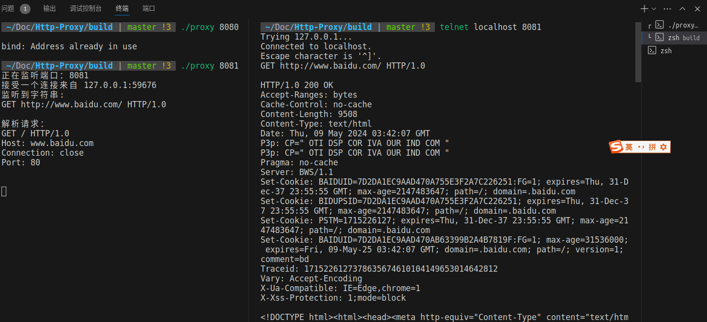
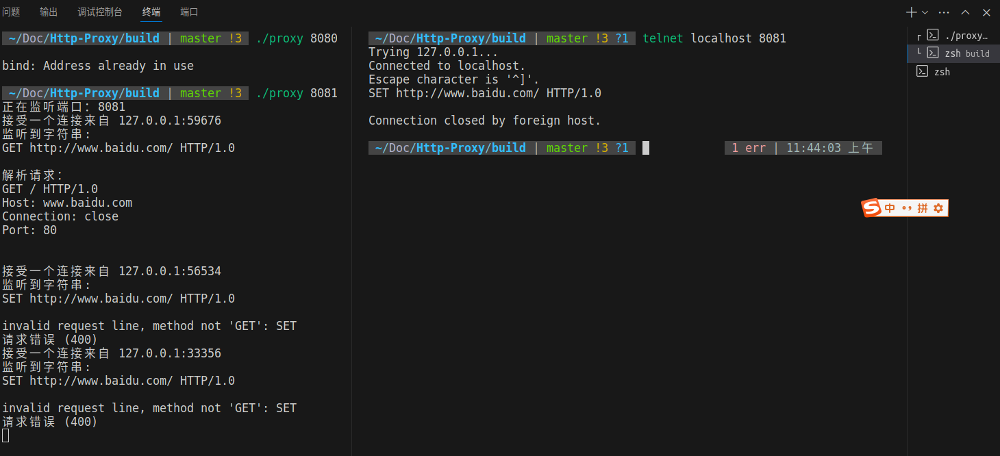

# HTTP代理

HTTP代理是实现中南大学计算机网络实验的一个开源项目，实验要求放在pdf中，实验文档中提到的proxy_parse.h库老师并没有直接给出（疑惑），我是在其他大学课程实验的开源中找到的，原开源如下：

https://github.com/grasscannoli/HTTP-Proxy

本项目通过CMake构建，能够跨平台编译运行，我是使用Ubuntu系统完成的，以下操作步骤均是在Linux下实现的。

## 如何运行

**编译：**

```
mkdir build
cd build
cmake ..
make
```

**运行：**

```
./proxy <端口号>
```

例子：

```
./proxy 8080
```

如果出现端口已经被绑定，则需要更换一个端口。

## 测试

在一个新的终端中启动telnet：

```
telnet localhost 8080
```

输入请求命令，最后输入换行：
```
GET http://www.baidu.com/ HTTP/1.0
```


如果输入其他类型的请求会报错：

```
SET http://www.baidu.com/ HTTP/1.0
```

